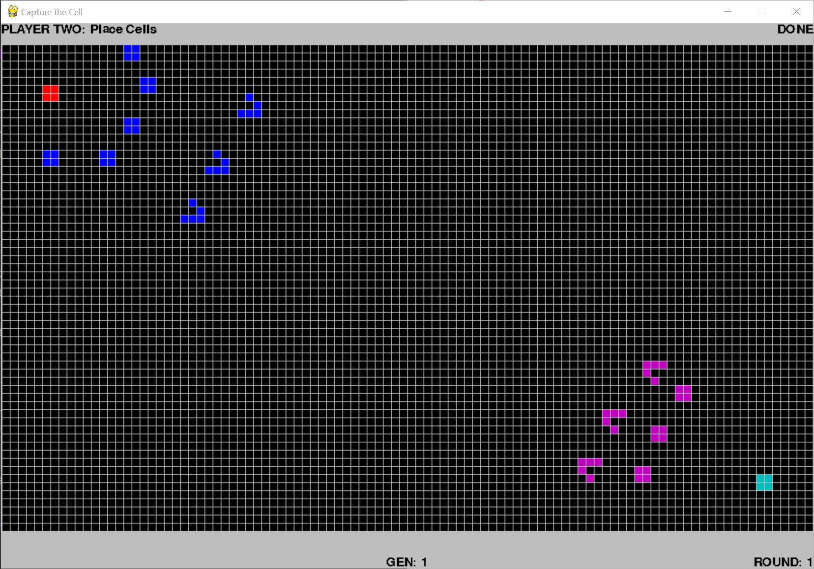

# Capture the Cell

An original 2 player game in which players must use patterns from Conway's Game of Life to defend their static block while trying to capture the other player's static block.

### How to Run
0. ensure that python 3.5 and pygame are installed
1. run CaptureCell.py

### How to Play
The game is round based with 75 generations per round.
Each round:
- First, player one creates the patterns they wish to use by clicking cells then hits DONE in the top right
- Then, player two creates the patterns they wish to use the same way
- Click the start button to initiate round

Patterns that move turn green and remain so while alive. Static patterns do not change colour. 

Between rounds, each player can add new patterns or modify existing patterns.  

The first player to lose their static block pattern loses. 

